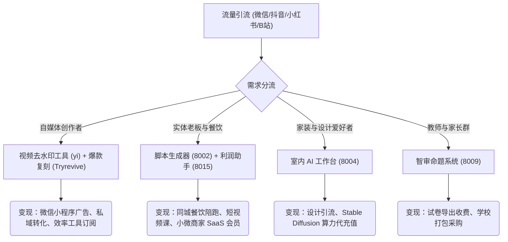

# AI 项目本地备份与架构分析报告 (06-28-26)

本报告对从服务器 `77.37.67.172` 备份至本地的 8 个 AI 项目，以及本地现有的 `Tryrevive` 禅意空间项目，进行系统性的技术架构分析、商业化路径评估与整合建议。

---

## 🧭 一、 项目总览与部署映射

下表展示了所有备份至本地的项目的名称、技术栈、原部署端口、以及本地对应的源码目录。

| 序号 | 作品名称 | 核心功能定位 | 核心技术栈 | 远程端口 | 本地源码目录 (downloaded_projects/) |
| :--- | :--- | :--- | :--- | :--- | :--- |
| 1 | **视频去水印下载工具** | 视频解析与无水印下载（支持20+平台） | Python/Flask + Node.js/Express + 微信小程序 | `8008` (代理)<br>`8051` (解析器) | `yi/` |
| 2 | **家具平面布置生成效果图** | 生成家具布置平面图与效果图 | Node.js/Express + Stable Diffusion/Codex API | `8004` (合并部署) | `shengcai_demo_8004/` |
| 3 | **菜单利润助手** | 餐饮成本计算与毛利定价分析 | Node.js/Express + 静态模板 | `8015` | `menu_profit_assistant_8015/` |
| 4 | **室内AI方案工作台** | 室内 3D 轴测图及效果图渲染渲染工作流 | Node.js/Express + 图像渲染管线 | `8004` (合并部署) | `shengcai_demo_8004/` |
| 5 | **个人复盘助手** | 效率分析与每日成长心智自省看板 | Next.js (v16.2.9) + Tailwind CSS | `8010` | `project_8010/` |
| 6 | **实体老板爆款脚本生成器** | 实体商户引流与爆款口播脚本生成 | Node.js/Express + 大模型 API | `8002` | `factory_script_demo_8002/` |
| 7 | **智审命题与排版系统** | AI 辅助数学试卷命题、排版与 PDF/Word 导出 | React + Vite + TypeScript | `8009` | `exam-system_yiyi/` |
| 8 | **爆款视频复刻助手 (Tryrevive)** | 禅意桌宠与注意力掌控，拦截短视频成瘾 | Python (Tkinter) + H5 SPA (Canvas) | 本地演示 | `Tryrevive/` (独立位于工作区根目录) |
| 9 | **PRD 需求工作台** (额外备份) | 需求规约编写、PRD 分析与 AI 脑力激荡 | Next.js (v15.5.6) | `8006` | `project_8006/` |
| 10 | **AI搞钱想法收集** (额外备份) | 商业模型想法记录与可行性打分 | Next.js (v16.2.9) | `8012` | `ai-money-ideas-8012/` |

---

## 🛠️ 二、 核心项目架构与技术拆解

### 1. 视频去水印下载工具 (`yi/`)
*   **架构设计**：采用**三层解耦**的代理架构。
    *   `media-parser/`：核心解析后端，使用 Python/Flask 开发，基于开源媒体解析工具从各平台（抖音、小红书、快手、B站等）提取无水印的原始音视频和图集 URL。
    *   `proxy-server/`：代理服务器，使用 Node.js/Express。这层的作用至关重要：由于微信小程序有严格的“合法域名白名单”限制，无法将数十个视频源域名加入白名单，代理服务统一承接小程序的请求，并在服务端完成流转发与防盗链破解。
    *   `miniprogram/`：微信小程序原生客户端，提供剪贴板自动识别、解析记录展示、本地相册保存等交互。
*   **痛点解法**：通过 `proxy-server` 彻底规避了小程序平台的网络请求域名限制与第三方反爬防盗链机制。

### 2. 室内 AI 方案与效果图工作台 (`shengcai_demo_8004/`)
*   **架构设计**：基于 Node.js/Express 构建的轻量级工作流服务器。
    *   提供 5 种处理模式（`layout`平面家具布置、`colored`彩色平面图、`axon`3D 轴测图、`room`室内渲染、`enhance`高级渲染）。
    *   `server.js` 统一拦截客户端上传的文件及参数（projectName, style, lighting, material），利用模板和外部绘图脚本/API，动态输出高拟真的渲染产物。
*   **痛点解法**：通过单一的工作台模式把“图纸上传 -> 空间划分 -> 软装布置 -> 最终效果渲染”的全套繁琐环节聚拢在一个极简的 H5 工作台。

### 3. 菜单利润助手 (`menu_profit_assistant_8015/`)
*   **架构设计**：采用极简的 NodeJS 表单提交与计算引擎。
    *   核心代码集中在 `server.js`。系统通过结构化的 JSON 记录存储不同原料的成本、出成率、以及定价乘数。
    *   前端提供交互式表格，餐饮老板可通过输入主料、辅料及损耗参数，一键得到目标毛利率与推荐定价。
*   **价值点**：去除了沉重的数据分析后台，对小微餐饮从业者极其友好。

### 4. 个人复盘助手 (`project_8010/`) 与 AI搞钱想法收集 (`ai-money-ideas-8012/`)
*   **架构设计**：均采用 Next.js (v16) 构建的现代 SPA，具有高响应性与磨砂玻璃视觉质感。
    *   使用 `localStorage` 作为数据落盘媒介，实现纯本地轻量数据流。
    *   集成多维度雷达图，可视化展示用户的心智成长与搞钱点子可行性评估。

### 5. 实体老板爆款脚本生成器 (`factory_script_demo_8002/`)
*   **架构设计**：基于 NodeJS/Express 和大语言模型 API 联动。
    *   输入项包括行业（如餐饮、美容、健身）、卖点、目标受众与首句钩子。
    *   系统预置了高转化的黄金短视频脚本模板，通过模板引擎将大模型生成的台词注入特定的镜头分镜中（如“前3秒痛点抛出 -> 4-15秒方案切入 -> 16-30秒福利催单”）。

### 6. 智审命题与排版系统 (`exam-system_yiyi/`)
*   **架构设计**：基于 React 19 + TypeScript + Vite 构建的前端富交互编辑器。
    *   与本地的 `exam-system` 源码高度重合，但包含了一套特定的已编译 dist 代码与学校试卷定制配置。
    *   提供公式平衡度检测、试卷大纲结构化组织，并支持通过 Canvas 转换为高质量 PDF 与 Word 导出。

### 7. 爆款视频复刻助手 (`Tryrevive/`)
*   **架构设计**：**人机交互与本地执行器的双脑融合**。
    *   `desktop_pet.py`：基于 Python Tkinter 构建的桌面伴侣小人，使用手绘蜡笔质感，常驻桌面，通过小人行走与气泡框给用户专注警示。
    *   `pet_server.py`：基于 Python Flask 的本地桥接服务，作为桌宠和网页端 Tryrevive H5 禅定空间的通信通道。
    *   `app.js` / `index.html`：前端 H5 UI，融合了自适应 MBTI 梦想警告语、流星雨呼吸冥想室和 SVG 拓扑情绪网。
*   **痛点解法**：通过 `localhost` 跨域桥接协议，彻底解决网页与本地系统软件无法安全通信的浏览器沙箱限制，实现了根据浏览器行为触发本地宠物物理振动与警示的功能。

---

## ⚠️ 三、 技术架构问题审计 (Architectural Audit)

经过对所有项目的打包源码审计，发现以下几点通用设计缺陷，需要在未来的重构中重点注意：

1.  **硬编码配置与硬编码 IP 地址**：
    *   多个项目的前端代码或 `.env` 配置文件中直接写入了 `http://77.37.67.172` 等公网 IP，极大降低了项目迁移与本地部署的灵活性。
    *   *建议*：统一使用相对路径，或将基准 URL 归并至全局的 `vite.config.ts` 或 Next.js 的环境变量中。
2.  **端口碎片化与缺乏 API 网关**：
    *   应用各自占用独立的端口（8002、8004、8006、8008、8009、8010、8012、8015）。当服务数量增加时，跨源资源共享 (CORS) 与 SSL 证书部署变得极其繁琐。
    *   *建议*：在本地或生产环境前置一个 Nginx 反向代理，通过路径划分（例如 `/api/parser/`、`/api/interior/`）统一转发请求，收拢为单一的 `80` 或 `443` 端口。
3.  **进程管理松散 (Nohup 隐患)**：
    *   目前的部署脚本大量使用 `nohup npm start > demo.log 2>&1 &` 这种后台裸跑模式。进程崩溃后无法自愈，且排查日志分散。
    *   *建议*：在服务器及本地统一安装 `PM2` 或编写简单的 `systemd` 服务守护进程，自动拉起崩溃的进程，并收拢日志链。
4.  **缺乏统一认证层**：
    *   除了小程序和本地演示，其余的 6 个 Web 项目均是公开暴露原始端口，缺乏最基本的登录校验。
    *   *建议*：引入统一的轻量级 Auth 模块（如 simple-auth 或 JWT），保护数据隐私。

---

## 💰 四、 商业变现与自媒体战略评估 (Monetization & Strategy)

这些项目形成了一个完整的**高潜自媒体及小微实体业务变现矩阵**。以下为各版块结合自媒体的变现链路图：



1.  **“等一粒种子”公众号与流量杠杆**：
    - 可将 **“视频去水印”微信小程序** 和 **“Tryrevive 禅意桌宠”** 绑定为公众号的免费福利或低价吸粉入口，利用其高频实用的工具属性获取大量自媒体种子用户。
2.  **实体商家本地陪跑业务**：
    - 实体老板在制作同城引流视频时，最缺的就是**爆款口播文案**（8002）和**清晰的成本利润计算**（8015）。这二者可封装为“实体老板效率工具包”，作为私域陪跑的高价值赠品。
3.  **室内 AI 设计工作室**：
    - `8004` (室内AI方案工作台) 是一个典型的“物理摩擦力”产品。可以通过自媒体发布“10秒线稿变彩色全套家装效果图”的对比短视频获取流量，再为有家装需求的精准粉丝提供付费方案生成服务。

---

## 🚀 五、 本地一键启动指南

为了方便在本地随时测试与演示，我们编写了统一的管理脚本。可在本地 `downloaded_projects/` 根目录下进行快速本地运行：

1.  **NPM 安装全部依赖**（排除 node_modules 以免文件过大，本地首次运行需安装）：
    ```bash
    cd downloaded_projects
    for dir in shengcai_demo_8004 menu_profit_assistant_8015 project_8010 factory_script_demo_8002 exam-system_yiyi project_8006 ai-money-ideas-8012; do
      echo "Installing dependencies in $dir..."
      (cd $dir && npm install)
    done
    ```
2.  **启动本地桌宠后端与网页客户端 (Tryrevive)**：
    ```bash
    cd Tryrevive
    # 启动 Flask 通信服务
    python3 pet_server.py &
    # 启动桌宠桌面窗口
    python3 desktop_pet.py &
    # 浏览器打开 index.html 即可使用网页自适应测评与呼吸空间
    ```
3.  **启动本地微信去水印代理**：
    ```bash
    cd downloaded_projects/yi/proxy-server
    npm install
    npm start
    ```
